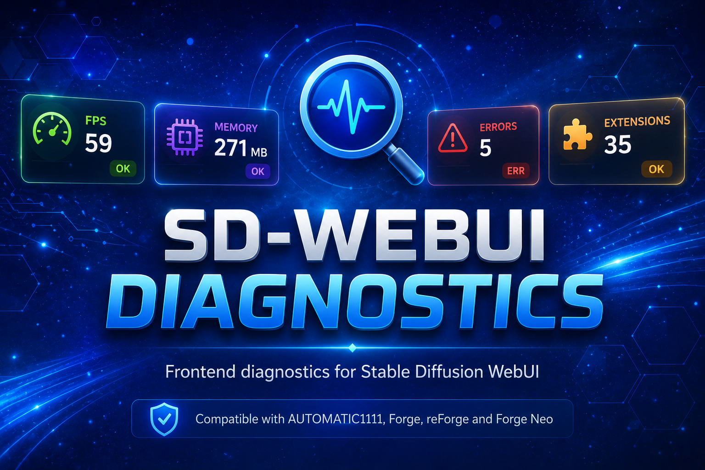

> **Lightweight performance profiler for Stable Diffusion WebUI**

# 🔍 SD-WebUI Diagnostics

A lightweight frontend profiler that runs directly inside your Stable Diffusion WebUI tab. Track extension startup times, JavaScript memory leaks, slow event handlers, network latency, frame drops, and UI blocking events — all in real time, without external tools or Python overhead.

---

## 📋 Table of Contents

- [What's New](#-whats-new)
- [Features](#-features)
- [Installation](#-installation)
- [Quick Start](#-quick-start)
- [Changelog](#-changelog)
- [Credits](#-credits)

---

## 🆕 What's New

### v0.2.1 — Fix: Settings `enabled` toggle now respected on boot and runtime
- **Config File Race Condition Fixed** — `diagnostics_config.js` is now written *after* settings are registered, so `enabled=false` is preserved across restarts.
- **Runtime Disable** — Frontend polls backend state and calls `destroyWidget()` if the toggle is turned off, removing the panel without requiring a page reload.
- **Safe Save Hook** — Monkey-patches `shared.opts.save` to rewrite config files immediately when clicking "Apply settings".

### v0.2.0 — 3-State Floating Widget + Magnetic Docking
- **Three UI States** — Icon (minimal badge), Bar (compact header with badges), and Expanded (full panel with tabs). ⭐
- **Magnetic Corner Docking** — Drag the handle (⋮⋮⋮) to any screen edge; widget snaps to the nearest corner and remembers its position. ⭐
- **Smart Auto-Collapse** — Expanded panel automatically collapses back to your last minimized state (icon or bar) after 30s of inactivity.
- **Icon Metric Selector** — Choose which metric appears on the icon badge: errors, INP, memory, FPS, or 🔍 lupa (via Settings).
- **Gradio 4 / Svelte Compatibility** — Eliminated global event-listener patches that were breaking Forge Neo's tab system.

### v0.1.0 — Cross-Platform Frontend Profiler
- **Universal Compatibility** — Works on AUTOMATIC1111, Forge, reForge, and Forge Neo (Gradio 3 & 4). ⭐
- **FPS Meter + Real Frame Drops** — Detects actual skipped frames by measuring frame delta timing, not just FPS averages. ⭐
- **Resource Loading Timeline** — See which JS/CSS/images are slowing down your page load. ⭐
- **Gradio Call Timing** — Measures how long each backend call takes (Generate, queue, predict) with separate tracking. ⭐
- **MutationObserver DOM Tracking** — Detects in real time when extensions inject new nodes into the page. ⭐
- **Long Task Observer** — Catches when the browser main thread blocks for >50ms.
- **Auto-Collapse Panel** — Panel closes automatically after 30s of inactivity so it never gets in your way.
- **Clear Metrics Button** — Reset all data and start a fresh profiling session without reloading.

---

## 🎯 Features

> ⭐ = Core Highlights

### 🔍 Performance Profiling
- **Startup Time per Extension** — See exactly how long each extension takes to initialize via `onUiLoaded` / `onUiUpdate` hooks. ⭐
- **Input Delay (INP)** — Detects when keystrokes, clicks, or slider moves get stuck waiting in the browser queue.
- **Layout Shifts (CLS)** — Spot which UI elements jump around during page load.
- **Memory Timeline** — Track JavaScript heap usage over time (Chrome only) to catch leaks. ⭐
- **FPS + Frame Drops** — Real-time frames-per-second counter with actual drop detection based on frame timing. ⭐

### 🌐 Network & API
- **Network Calls** — Intercepts all `fetch` and `XMLHttpRequest` calls, showing URL, method, status, and duration. ⭐
- **Gradio Calls** — Separates backend API calls (predict, queue, run) from generic network traffic so you know exactly how long Generate is taking. ⭐
- **Resource Loading** — Uses `PerformanceObserver` to flag slow assets (scripts, stylesheets, images). ⭐

### 🐛 Errors & Debugging
- **Console Error Capture** — Collects `console.error`, `console.warn`, and unhandled exceptions from all extensions in one place.
- **Slow Event Handlers** — Wraps `addEventListener` to flag handlers freezing the UI for >50ms.
- **Long Tasks** — Detects main-thread blocks that make the interface unresponsive.

### 📊 DOM & Extensions
- **DOM Nodes by Extension** — Counts how many HTML elements each extension injected, updated in real time via `MutationObserver`. ⭐
- **Live Badge Strip** — Collapsed pill shows INP, CLS, FPS, network, errors, and more at a glance.

### 💾 Export & Control
- **Export JSON Report** — Downloads a full snapshot of all metrics for attaching to GitHub issues. ⭐
- **Clear Metrics** — One-click reset without reloading the page.
- **Auto-Collapse** — Panel hides itself after 30 seconds of inactivity.

---

## 📦 Installation

### Inside SD WebUI (Recommended)

1. Open your WebUI and go to the **Extensions** tab.
2. Click on the **Install from URL** sub-tab.
3. Paste: `https://github.com/eduardoabreu81/sd-webui-diagnostics`
4. Click **Install**.
5. Go to the **Installed** sub-tab and click **Apply and restart UI**.

> ⚠️ Compatible with AUTOMATIC1111, Forge, reForge, and Forge Classic / Neo.

---

## 🚀 Quick Start

1. After reloading the WebUI, look for the small **🔍 pill** in the bottom-right corner.
2. Click it to expand the diagnostics panel.
3. Interact with your WebUI (type in the prompt box, click Generate, switch tabs).
4. Watch the badges update in real time — red badges mean something is slow!
5. Click any section to see detailed bars and timings.
6. Found a problem? Click **📥 Export JSON Report** and attach the file to your issue.

---

## 📖 Changelog

### v0.2.1 — Fix: Settings `enabled` respected on boot and runtime (2026-05-08)
- Fixed config file being written at import-time (before `shared.opts` registered saved values), which caused `enabled=false` to be ignored on every restart.
- Added `_get_config()` helper and exposed settings via `/sd-webui-diagnostics/api/state`.
- Frontend: added `destroyWidget()` cleanup, defensive `if (!el) return;` guards in all `render*()` functions, and drag-handler null checks.

### v0.2.0 — 3-State Floating Widget + Magnetic Docking (2026-05-07)
- **Three UI States** — Icon (minimal badge), Bar (compact header), Expanded (full panel).
- **Magnetic Corner Docking** — Drag handle (⋮⋮⋮) to any edge; snaps to nearest corner.
- **Smart Auto-Collapse** — Returns to last minimized state (icon/bar) after 30s inactivity.
- **Settings:** `icon_metric`, `default_state`, `position_anchor`.
- **Gradio 4 / Svelte fixes** — Safe `addEventListener` wrapper (no `JSON.stringify`), event delegation instead of inline handlers, retry-based `init()` for async DOM.

### v0.1.0 — Cross-Platform Frontend Profiler
- Universal compatibility with A1111, Forge, reForge, and Forge Neo.
- FPS meter with real frame-drop detection.
- Resource loading timeline.
- Gradio call timing (predict, queue, run).
- MutationObserver for real-time DOM tracking.
- Long task observer for main-thread blocking.
- Auto-collapse panel after inactivity.
- Clear metrics button.
- Fixed `removeEventListener` memory leak via `WeakMap`.

---

## 📄 Credits

- Built for the Stable Diffusion WebUI community.
- Inspired by the need to debug extension performance without guessing.

---

## 📜 License

MIT — see [LICENSE](LICENSE)

---

Made with ❤️ for the Stable Diffusion community

**[Report Bug](https://github.com/eduardoabreu81/sd-webui-diagnostics/issues)** • **[Request Feature](https://github.com/eduardoabreu81/sd-webui-diagnostics/issues)** • **[Discussions](https://github.com/eduardoabreu81/sd-webui-diagnostics/discussions)**

